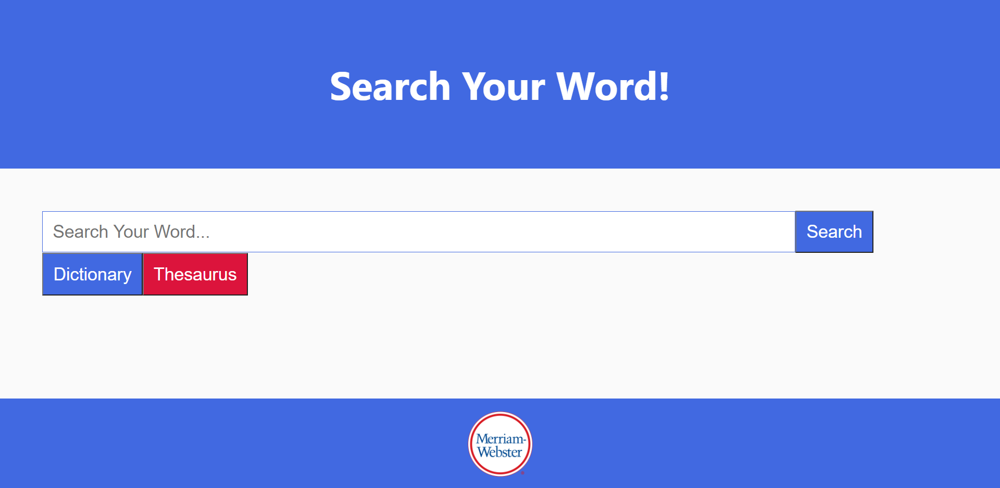
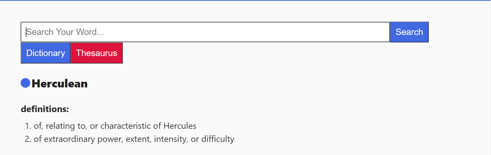
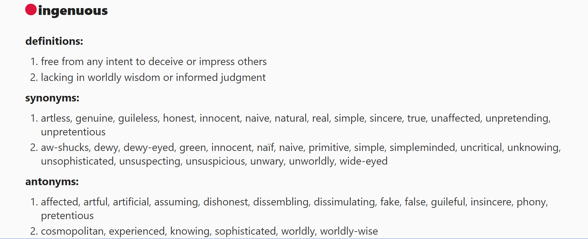
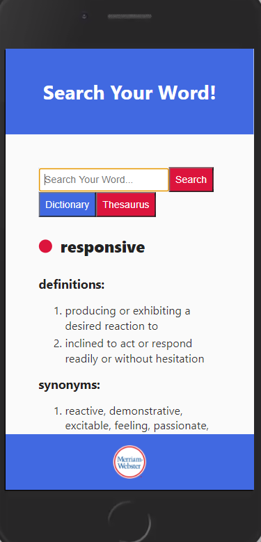

# Search Your Word
This is a very simple client React app that allows the user to search for definitions and synonyms/antonyms using the input the field. HTTP GET requests with Axios are sent to Meriam-Webster's Collegiate Dictionary and Merriam-Webster's Collegiate Thesaurus reference APIs.

### Homepage

### Search for a definition: 

### Search using the Thesaurus:

### Responsive design:

